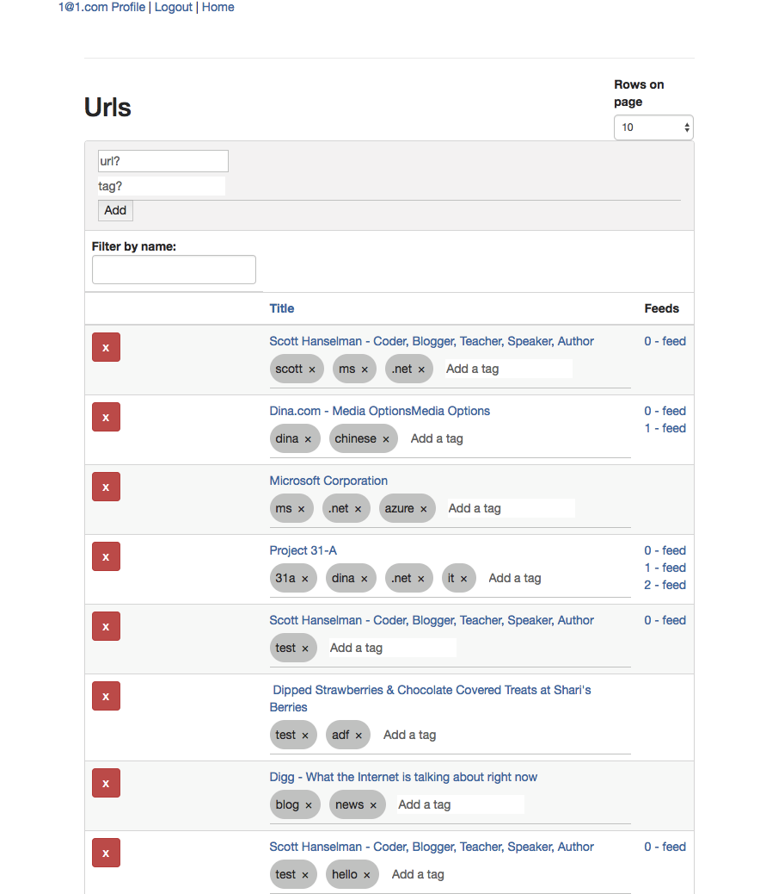
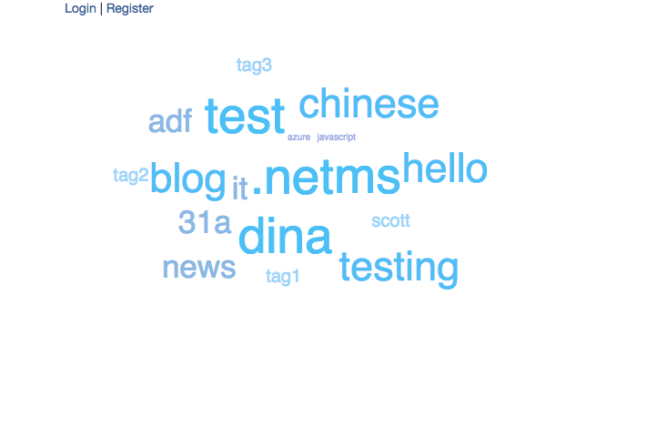

# Karma/Jasmine in browser
1. npm run test:unit-in-browser
2. open url in browser: http://localhost:3005/

# Karma/Jasmine cli
1. npm run test:unit

# Start client only
1. npm start
2. open url in browser: http://localhost:3000

# Start server/api on port (3003) & client on port 3000
1. npm start
 - assumes client and server repos are in sibling folders
 - assumes config for server states port 3003
 - assumes mongo config for server is set and mongo is running
2. open url in browser: http://localhost:3000

# User's Url Listing
- add new url with tags
- filter urls
- page through urls
- table displays web site's title, link to feeds, and customer-entered tags

# Tag Cloud
- shows top 20 tags across all accounts

# Testing Philosophy
- happy path first
- camp ground cleanup
- automation always 
